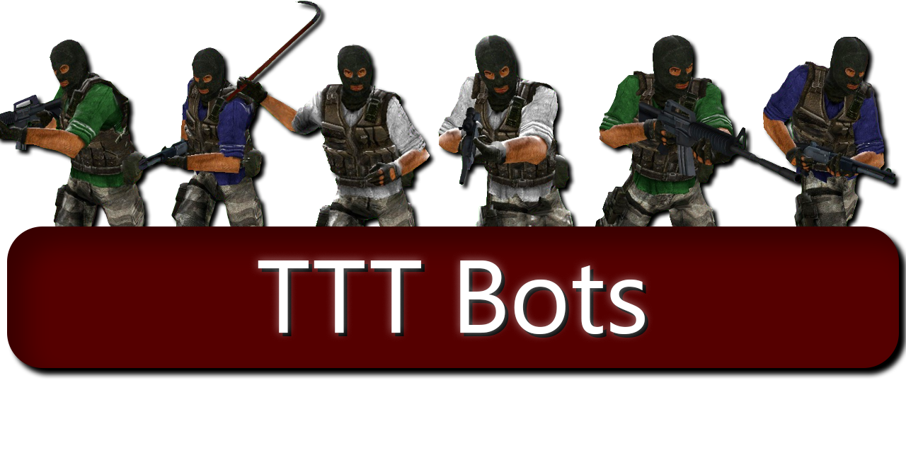

🎄🎁 The mod has been released on Steam. Merry Christmas! 

Please leave any bug reports or feature requests in the Issues section.

## What is this?
This is a player bot addon for the Trouble in Terrorist Town game mode in Garry's Mod.

It is designed to be as modular as possible, allowing easy customization and expansion. It is designed for TTT2 while being fully playable in regular TTT.

## How to use
1. Download the latest version from the [Steam Workshop](https://steamcommunity.com/sharedfiles/filedetails/?id=1256344426).
2. Start a Peer-to-Peer or SRCDS with sufficient player slots on a map with a navmesh or one of the included maps.
3. *As a super admin,* either type `!addbot X` in chat or write `ttt_bot_add X` in the console.
4. You're done!

## Usage and Commands
An essential usage guide can be found [here](https://github.com/thebigsleepjoe/TTT-Bots-2/wiki/Basic-Usage-Guide). It will give you all the info you need for 90% of cases. A more in-depth set of guides are WIP.

## For developers
TODO: Create a wiki article for devs

## Vague to-do list
- Create some more bot maps as separate addons, but link them here.
- Implement the !botmenu: blacklist/whitelist certain traits, change bot count, etc.
- Have bots be able to emulate using the DNA scanner (??)]
- Anything in the Issues section marked as an approved feature request

## License
I am committed to keeping this project open-source and easily accessible to everyone. I want developers and bot enthusiasts to be able to examine my code, offer feedback, and contribute. However, I have invested much time and effort into developing this project to its current state. Therefore, I have licensed it under CC-BY-SA 4.0, which allows you to clone, use, modify, and redistribute my content freely as long as you give me credit upon modification and use the same license. You can find more information about the license in the LICENSE.txt file.

Please do not re-upload as-is to any other website.
